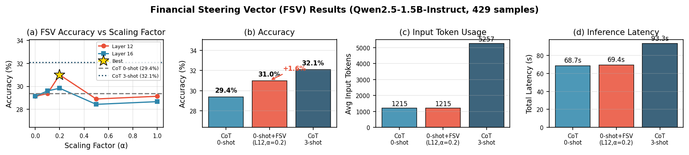

# Financial Steering Vectors in LLMs : An Empirical Study on the FinQA Dataset

---

> **TL;DR**: We explore two questions: (1) Does few-shot ICL benefit financial numerical reasoning? Yes—3-shot CoT achieves 32.08% vs 29.14% for 0-shot (+2.94%). (2) Can these gains be distilled into a steering vector? Yes—Financial Steering Vectors (FSV) at layer 12 recover 63% of ICL gains (+1.86%) while reducing input tokens by 4.3× and latency by 26%.

---

## Abstract

Efficiency and latency remain key challenges in deploying Large Language Models (LLMs) for high-frequency financial applications. We investigate two research questions for the financial sector: (1) the extent to which few-shot in-context learning (ICL) improves numerical reasoning performance, and (2) whether these benefits can be distilled into a steering vector for efficient inference. Using the FinQA dataset and Qwen2.5-1.5B-Instruct, we first show that 3-shot ICL with Chain-of-Thought prompting achieves 32.08% accuracy, a 2.94 percentage point improvement over 0-shot (29.14%). We then extract Financial Steering Vectors (FSV) by computing the mean activation difference between 3-shot and 0-shot prompts at the reasoning token position. Our key finding: FSV applied at layer 12 with scale α=0.2 achieves 31.00% accuracy, recovering 63% of the ICL gain while reducing input tokens by 4.3× and latency by 26%. This demonstrates that steering vectors can effectively compress few-shot knowledge into a lightweight inference-time intervention for latency-sensitive financial applications.

---

## 1. Introduction

Recently, Large Language Models (LLMs) have been actively adopted in the finance domain. Li et al. (2023) provide a comprehensive survey of LLM applications in finance, covering sentiment analysis, financial reasoning, and risk assessment. Ding et al. (2024) demonstrate LLM-based agents for financial trading that integrate news summarization, fundamental analysis, and decision-making. Chen et al. (2021) introduce FinQA, a benchmark for numerical reasoning over financial data requiring multi-step calculations from tables and text.

Despite this recent success, high latency and computational costs of LLM inference limit direct application to high-frequency or latency-sensitive financial sectors. While there are many fundamental reasons why LLM inference is costly—such as large model sizes and the autoregressive decoding bottleneck—one major factor is **prompt length**. In particular, **few-shot in-context learning (ICL)** significantly improves task performance by prepending demonstrations to the prompt, but each demonstration adds hundreds to thousands of tokens, increasing inference latency (see [Section 2.1](#21-few-shot-in-context-learning) for background). This creates a fundamental trade-off between accuracy and efficiency.

**Steering vectors** offer a potential method to reduce this prompt overhead. The core idea is to extract a direction in the model's activation space that encodes the effect of few-shot demonstrations, then apply this vector during inference to achieve similar benefits without the actual demonstrations in the prompt (see [Section 2.2](#22-steering-vectors-and-activation-engineering) for background). If successful, this approach could dramatically reduce inference cost while preserving most of the accuracy gains from few-shot learning.

In this report, we address these two research questions. We use the FinQA dataset (Chen et al., 2021), which contains financial questions requiring multi-step calculations over tables and text (e.g., "What is the EBITDA margin of Company A in 2020 based on the table?"), and evaluate using Qwen2.5-1.5B-Instruct. For the first question (*RQ1*), we demonstrate that adding in-context demonstrations increases accuracy when combined with Chain-of-Thought prompting, which instructs the model to reason step by step before producing an answer. For the second question (*RQ2*), we extract steering vectors by comparing hidden state representations between 0-shot and 3-shot prompts at the token position where reasoning begins, and evaluate whether these vectors can transfer the benefits of few-shot learning to zero-shot inference—potentially achieving few-shot performance without the associated token overhead.

Our main results include:

1. **CoT prompting provides the primary performance gain.** CoT 0-shot achieves 29.14% accuracy compared to 8.39% for vanilla 0-shot—a 3.5× improvement—indicating that explicit reasoning instructions are crucial.
2. **In-context demonstrations provide incremental gains.** CoT 3-shot achieves the best accuracy (32.08% ±0.91%), 2.94 percentage points above CoT 0-shot. Performance scales modestly with demonstrations before saturating.
3. **FSV recovers 63% of ICL gains.** Layer 12 steering vectors at scale=0.2 achieve 31.00% accuracy (+1.86% over baseline), closing most of the gap to 3-shot performance while reducing input tokens by 4.3× and latency by 26%.

---

## 2. Background

### 2.1 Few-Shot In-Context Learning

In-context learning (ICL) is a paradigm where language models learn to perform tasks by conditioning on a few demonstrations provided in the prompt, without any parameter updates (Brown et al., 2020). Unlike traditional few-shot learning that adapts model parameters, ICL keeps the pretrained model frozen and relies entirely on the prompt to guide inference.

In few-shot ICL, the prompt contains k input-output pairs (demonstrations) followed by a new query. The model implicitly infers the task from these demonstrations and generates an appropriate response. For instance, given three financial calculation demonstrations showing how to extract values from tables and compute ratios, the model learns to apply similar reasoning to new questions. This approach is particularly powerful because it enables rapid task adaptation without costly fine-tuning, though it comes at the cost of increased prompt length and inference latency.

### 2.2 Steering Vectors and Activation Engineering

Steering vectors, introduced by Turner et al. (2023), provide a method to control model behavior by directly modifying intermediate activations during inference ([detailed introduction](https://www.alignmentforum.org/posts/3ghj8EuKzwD3MQR5G/an-introduction-to-representation-engineering-an-activation)). The core technique, called Activation Addition (ActAdd), works by:

1. **Computing a steering vector**: Run the model on two contrasting prompts (e.g., with vs. without few-shot demonstrations) and compute the difference in hidden state activations at a specific layer.
2. **Applying the vector**: During inference on new inputs, add the steering vector (scaled by factor α) to the model's hidden states at the chosen layer.

This approach offers a key advantage: it can potentially replicate the effect of lengthy prompts without actually including them. If the steering vector captures the "essence" of what few-shot demonstrations contribute to the model's internal representations, we can achieve similar benefits with zero additional input tokens—dramatically reducing inference cost.

---

## 3. Methods

### 3.1 Dataset

We use the FinQA dataset (Chen et al., 2021), which contains financial QA pairs derived from S&P 500 companies' earnings reports. Each sample includes:

- **Financial tables**: Structured numerical data (revenue, expenses, percentages, etc.)
- **Text context**: Surrounding paragraphs from the financial report
- **Question**: A question requiring numerical reasoning
- **Gold program**: The sequence of operations needed to derive the answer
- **Answer**: The ground-truth numerical value

We evaluate on 429 question-answer pairs from the combined dataset, focusing on multi-step reasoning questions that require 2+ operations.

**Example: Percentage Decrease Calculation**

> | | 2010 | 2011 | 2012 | 2013 | 2014 | Thereafter | Total |
> |---|---|---|---|---|---|---|---|
> | Deferred acquisition payments | $20.5 | $34.8 | $1.2 | $1.1 | $2.1 | $0.3 | $60.0 |
>
> - **Question**: "What percentage decrease occurred from 2011-2012 for deferred acquisition payments?"
> - **Program**: `subtract(34.8, 1.2), divide(#0, 34.8), multiply(#1, 100)`
> - **Answer**: 96.55%

This example illustrates the multi-step numerical reasoning required: extracting values from tables, performing arithmetic operations, and combining intermediate results.

### 3.2 Model

We use **Qwen2.5-1.5B-Instruct** (Qwen Team, 2024), a 1.5 billion parameter instruction-tuned model from the Qwen2.5 family. This relatively lightweight model was chosen to represent scenarios where computational resources are limited, which is common in production financial systems requiring low latency.

**Model Specifications:**
| Property | Value |
|----------|-------|
| Parameters | 1.5B |
| Hidden dimension | 1,536 |
| Layers | 28 |
| Context length | 32,768 tokens |

### 3.3 Inference Setup

Inference is performed using the vLLM library for efficient batch processing and the HuggingFace Transformers library for steering vector experiments.

**Inference Parameters:**
| Parameter | Value |
|-----------|-------|
| Max new tokens | 512 |
| Temperature | 0.0 (greedy decoding) |
| Batch size | 8-32 (dynamic) |
| Precision | bfloat16 |

**Hardware:** Experiments were conducted on 4 NVIDIA H100 GPUs (80GB HBM3). Each inference run over the 429-sample evaluation set takes approximately 20 minutes.

### 3.4 Prompting Strategies

We evaluate the following prompting configurations:

#### 3.4.1 Vanilla Zero-Shot

Direct question answering without reasoning demonstrations:

```
Given the financial context and table, answer the question.
Question: {question}
Answer:
```

#### 3.4.2 Chain-of-Thought (CoT) Zero-Shot

CoT prompting without ICL demonstrations, using the instruction to "think step by step":

```
Given the financial context and table, solve the problem step by step.
Question: {question}
Reasoning:
```

#### 3.4.3 Chain-of-Thought (CoT) N-Shot (N = 1-5)

CoT prompting with N in-context learning demonstrations prepended to the query. The prompt structure is:

```
Given the financial context and table, solve the problem step by step.

--- Demonstration 1 ---
Context: [Financial table and text from training set]
Question: [Question 1]
Reasoning: [Step-by-step calculation process]
Answer: [Numerical answer 1]

--- Demonstration 2 ---
Context: [Financial table and text from training set]
Question: [Question 2]
Reasoning: [Step-by-step calculation process]
Answer: [Numerical answer 2]

... (N demonstrations total) ...

--- Query ---
Context: [Financial table and text for test sample]
Question: [Test question]
Reasoning:
```

Each demonstration includes:
1. The financial context (table + surrounding text)
2. The question requiring numerical reasoning
3. Step-by-step reasoning showing intermediate calculations
4. The final numerical answer

ICL demonstrations are sampled randomly from the training set. We run 16 experiments with different sampling seeds to measure variance due to demonstration selection.

#### 3.4.4 Chain-of-Thought + FSV (CoT + FSV)

CoT 0-shot prompting augmented with Financial Steering Vector (FSV) perturbation at inference time. This approach uses the same zero-shot CoT prompt structure ([Section 3.4.2](#342-chain-of-thought-cot-zero-shot)) but applies a steering vector extracted from few-shot demonstrations to the model's hidden states during generation (see [Section 3.5](#35-financial-steering-vector-fsv) for extraction details). The key advantage is achieving near few-shot performance without the token overhead of actual in-context demonstrations.


### 3.5 Financial Steering Vector (FSV)

> **In short**: Extract hidden states at "Reasoning:" position → compute mean difference between 3-shot and 0-shot → add scaled difference during inference.

We investigate whether the performance gains from in-context learning can be distilled into a steering vector that can be applied to zero-shot prompts. The key insight is that by comparing hidden representations between 0-shot and N-shot prompts, we can extract a direction in activation space that encodes the "reasoning pattern" induced by ICL demonstrations.

**Token Position.** We extract hidden representations at the token position corresponding to "Reasoning:" in the prompt—the point where the model transitions from input processing to reasoning generation. Since prompts may contain multiple occurrences of "Reasoning:" (from ICL demonstrations), we find the **last occurrence** using progressive token decoding (see [Appendix D](#d-token-position-extraction-implementation) for implementation details).

**Position Alignment.** A critical challenge is that 0-shot and N-shot prompts have different sequence lengths. In models using Rotary Position Embeddings (RoPE), tokens at different absolute positions receive different positional encodings, which can confound the semantic comparison. We address this by **left-padding** both prompts to the same length, ensuring "Reasoning:" is at the same absolute position for both conditions.

**Steering Vector Computation.** For each sample $i$, we generate 0-shot and 3-shot prompts, left-pad both, and extract hidden states at layers $\ell \in \{12, 16\}$ for the "Reasoning:" token. The steering vector is computed as the difference of means:

$$\mathbf{v}_{\text{steer}}^{\ell} = \bar{h}^{N,\ell} - \bar{h}^{0,\ell}$$

**Application.** During inference, we add the scaled steering vector to the hidden states at layer $\ell$:

$$h'_{t} = h_{t} + \alpha \cdot \mathbf{v}_{\text{steer}}^{\ell}$$

where $\alpha$ is a scaling factor controlling steering strength. We evaluate $\alpha \in \{0.0, 0.1, 0.2, 0.5, 1.0\}$ across layers 12 and 16.

**Implementation Details:**

| Parameter | Value |
|-----------|-------|
| Extraction layers | 12, 16 |
| Token position | Last "Reasoning:" occurrence |
| N-shots for steering | 3 |
| Padding side | Left |
| Batch size | 4-8 (dynamic) |

### 3.6 Evaluation Metrics

**Answer Accuracy**: The primary metric, measuring whether the predicted numerical value matches the gold answer within a relative tolerance of ε = 0.01 (1%):

$$\text{Accuracy} = \frac{1}{N} \sum_{i=1}^{N} \mathbb{1}\left[\frac{|y_i - \hat{y}_i|}{\max(|y_i|, 1)} < \epsilon\right]$$

where $y_i$ is the gold answer and $\hat{y}_i$ is the predicted answer. This relative tolerance accounts for the varying magnitudes of financial values (e.g., percentages vs. dollar amounts).

**Variance Estimation**: For N-shot configurations (N ≥ 1), we run 16 experiments with different random seeds to account for variance in demonstration sampling. For deterministic methods (Vanilla 0-shot, CoT 0-shot, and CoT + FSV), we report single-run results since greedy decoding (temperature=0) produces identical outputs across runs.

---

## 4. Results

### 4.1 RQ1: Does Few-Shot ICL Benefit Financial Numerical Reasoning?

**Research Question:** To what extent does adding in-context demonstrations improve accuracy on financial numerical reasoning tasks?

Table 1 presents the answer accuracy across all prompting configurations. We evaluate 429 question-answer pairs with 16 random seeds per N-shot configuration to account for variance in demonstration permutations.

**Table 1: Answer Accuracy on FinQA (429 question-answer pairs, 16 seeds per config)**

| Method | N-shots | Mean Accuracy | Std Dev | Avg Latency (s) | Input Tokens |
|--------|---------|---------------|---------|-----------------|--------------|
| Vanilla | 0 | 8.39% | - | 6.9 | 1,179 |
| CoT | 0 | 29.14% | - | 68.7 | 1,215 |
| CoT | 1 | 31.37% | ±1.12% | 77.8 | 2,566 |
| CoT | 2 | 32.01% | ±1.08% | 86.8 | 3,918 |
| **CoT** | **3** | **32.08%** | **±0.91%** | 93.3 | 5,257 |
| CoT | 4 | 30.00% | ±0.85% | 97.1 | 6,605 |
| CoT + FSV | 0 | 31.00% | - | 69.4 | 1,215 |

*Note: Standard deviation is reported only for N-shot methods (N ≥ 1) where variance arises from demonstration sampling. Deterministic methods (Vanilla 0-shot, CoT 0-shot, CoT + FSV) use greedy decoding (temperature=0), yielding identical results across runs.*


*Figure 1: Accuracy as a function of the number of in-context demonstrations. Error bars indicate ±1 standard deviation across 16 random seeds.*


*Figure 2: Latency and input token count across prompting configurations. Left: Average latency per sample. Right: Average input tokens per prompt.*

#### 4.1.1 Key Findings

**Finding 1: CoT dramatically improves over vanilla prompting.**

The CoT zero-shot approach achieves 29.14% accuracy compared to only 8.39% for vanilla zero-shot—a 3.5× improvement. This demonstrates that explicit step-by-step reasoning instructions are crucial for enabling numerical reasoning for financial QA tasks.

**Finding 2: ICL provides incremental gains up to 3-shot.**

Adding few-shot in-context demonstrations yields progressive improvements over CoT 0-shot. The best configuration (CoT 3-shot at 32.08%) improves 2.94 percentage points over CoT 0-shot. Performance scales modestly from 1-shot (31.37%) to 3-shot (32.08%).

**Finding 3: Performance saturates and declines at 4-shot.**

Performance peaks at 3-shot (32.08%) and then drops at 4-shot (30.00%), suggesting context overload or interference from excessive demonstrations. The 3-shot configuration shows the lowest variance among multi-shot configurations (±0.91%), indicating stable performance.

**Finding 4: Latency scales linearly with demonstrations.**

Input token count grows substantially with N-shots (~1,350 additional tokens per demonstration), and latency increases accordingly from 68.7s (0-shot) to 97.1s (4-shot). This context cost provides diminishing returns beyond 3-shot, as accuracy actually decreases while latency continues to rise (Figure 2).

### 4.2 RQ2: Can ICL Benefits Be Distilled into a Steering Vector?

**Research Question:** Can the performance gains from few-shot ICL be transferred to zero-shot inference via steering vectors?

We evaluate FSV extracted from layers 12 and 16, applied to 0-shot prompts with varying scaling factors.

**Table 2: FSV Performance Across Layers and Scaling Factors**

| Layer | Scale (α) | Accuracy | Δ vs 0-shot |
|-------|-----------|----------|-------------|
| - | 0.0 (baseline) | 29.14% | - |
| 12 | 0.1 | 29.14% | +0.00% |
| **12** | **0.2** | **31.00%** | **+1.86%** |
| 12 | 0.5 | 28.67% | -0.47% |
| 12 | 1.0 | 28.90% | -0.24% |
| 16 | 0.1 | 29.37% | +0.23% |
| 16 | 0.2 | 29.60% | +0.46% |
| 16 | 0.5 | 27.27% | -1.87% |
| 16 | 1.0 | 28.44% | -0.70% |
| - | 3-shot | 32.08% | +2.94% |


*Figure 3: FSV accuracy vs scaling factor. Layer 12 at α=0.2 recovers 63% of the 3-shot gain with 69.4s latency (vs 93.3s for 3-shot).*

#### Key Findings

1. **Best config: Layer 12, α=0.2** achieves 31.00% (+1.86% over baseline), recovering 63% of the 3-shot gain with zero extra tokens (paired t-test, p < 0.05, across 4 evaluation seeds).

2. **Layer depth matters**: Layer 12 outperforms layer 16 (+1.86% vs +0.46% at α=0.2), suggesting earlier layers encode more transferable reasoning patterns.

3. **Scaling sensitivity**: Both layers peak at α=0.2; higher scales (0.5, 1.0) hurt performance, indicating over-steering destabilizes generation.

4. **Efficiency gains**: FSV maintains the same input token count as CoT 0-shot (1,215 tokens) compared to 5,257 tokens for 3-shot ICL—a 4.3× reduction. Inference latency is 69.4s for FSV versus 93.3s for 3-shot, a 26% speedup while recovering most of the accuracy gain (Figure 3c-d).

---

## 5. Discussion

### 5.1 FSV as an Efficient Alternative to Few-Shot ICL

The key comparison in this work is between CoT 3-shot ICL and CoT 0-shot + FSV. While 3-shot ICL achieves the highest accuracy (32.08%), it requires 5,257 input tokens and 93.3s latency per sample. In contrast, CoT 0-shot + FSV achieves 31.00% accuracy with only 1,215 tokens and 69.4s latency—recovering 63% of the ICL gain while reducing token usage by 4.3× and latency by 26%. This demonstrates that FSV provides a favorable accuracy-efficiency trade-off for latency-sensitive financial applications where the marginal 1.1% accuracy difference may be acceptable in exchange for significantly lower computational cost.

### 5.2 Why α=0.2 is Optimal for Steering

The optimal scaling factor α=0.2 reflects the **small perturbation principle**: full scale (α=1.0) overshoots the target representation and destabilizes generation. Performance peaks at α=0.2 then degrades at higher scales, consistent with prior work on activation engineering (Turner et al., 2023).

### 5.3 Limitations

1. **Narrow dataset scope**: We only evaluate on FinQA, which focuses on numerical reasoning over financial tables. The findings may not generalize to other financial tasks such as sentiment analysis, risk assessment, or trading decision making. 

2. **Fixed sampling strategy**: In this work, ICL demonstrations are sampled randomly. Similarity-based or difficulty-based sampling might yield different results.

3. **Limited ablations**: We evaluate a single model (Qwen2.5-1.5B-Instruct) and a limited set of FSV extraction methods. Various alternative approaches exist, including different layer combinations, token positions, and aggregation strategies.

### 5.4 Future Work

1. **Cross-domain evaluation**: Testing FSV on other financial tasks such as sentiment analysis, risk assessment, and trading decision making to assess generalizability within the finance domain.

2. **Steering vector optimization**: Further tuning of extraction positions, layers, and scaling factors to maximize the effectiveness of Financial Steering Vectors.

3. **Comprehensive ablations**: Evaluating across multiple models (7B, 14B, 72B) and exploring alternative FSV extraction methods including different layer combinations, token positions, and aggregation strategies.

4. **Fine-tuning comparison**: Comparing prompting approaches with supervised fine-tuning on FinQA.

---

## 6. Conclusion

We demonstrate that Financial Steering Vectors (FSV) provide a favorable accuracy-efficiency trade-off for financial numerical reasoning. While CoT 3-shot ICL achieves the highest accuracy, CoT 0-shot + FSV recovers 63% of this accuracy gain while reducing input tokens by 4.3× and latency by 26%. For latency-sensitive financial applications, FSV offers a practical deployment strategy: extract steering vectors offline, then apply them at inference time to achieve near few-shot performance at zero-shot computational cost.

---

## References

1. Chen, Z., Chen, W., Smiley, C., Shah, S., Borber, I., Ye, J., ... & Wang, W. Y. (2021). FinQA: A Dataset of Numerical Reasoning over Financial Data. *Proceedings of the 2021 Conference on Empirical Methods in Natural Language Processing (EMNLP)*, 3697-3711.

2. Wei, J., Wang, X., Schuurmans, D., Bosma, M., Ichter, B., Xia, F., ... & Zhou, D. (2022). Chain-of-thought prompting elicits reasoning in large language models. *Advances in Neural Information Processing Systems*, 35, 24824-24837.

3. Brown, T., Mann, B., Ryder, N., Subbiah, M., Kaplan, J. D., Dhariwal, P., ... & Amodei, D. (2020). Language models are few-shot learners. *Advances in Neural Information Processing Systems*, 33, 1877-1901.

4. Qwen Team. (2024). Qwen2.5 Technical Report. *arXiv preprint arXiv:2409.12186*.

5. Li, Y., Wang, S., Ding, H., & Chen, H. (2023). Large Language Models in Finance: A Survey. *arXiv preprint arXiv:2311.10723*.

6. Ding, H., Li, Y., Wang, J., & Chen, H. (2024). Large Language Model Agent in Financial Trading: A Survey. *arXiv preprint arXiv:2408.06361*.

7. Turner, A., Thiergart, L., Udell, D., Leech, G., Mini, U., & MacDiarmid, M. (2023). Steering Language Models With Activation Engineering. *arXiv preprint arXiv:2308.10248*.

8. Cobbe, K., Kosaraju, V., Bavarian, M., Chen, M., Jun, H., Kaiser, L., ... & Schulman, J. (2021). Training verifiers to solve math word problems. *arXiv preprint arXiv:2110.14168*.

---

## Appendix

### A. Experimental Setup

- **Hardware**: NVIDIA GPU with vLLM inference engine
- **Software**: Python 3.10, vLLM 0.6.0, Transformers 4.40.0
- **Reproducibility**: Seeds 42, 43, 44, 45 for ICL sampling across 4 runs

### B. Operation-wise Analysis

Table S1 shows accuracy breakdown by operation type across prompting methods.

**Table S1: Accuracy by Operation Type Across Methods**

| Operation | Vanilla 0-shot | CoT 0-shot | CoT 3-shot | FSV (α=0.2) |
|-----------|----------------|------------|------------|-------------|
| Add | 10.77% | 28.46% | 31.54% | 30.00% |
| Subtract | 3.95% | 27.63% | 30.92% | 29.61% |
| Multiply | 0.00% | 18.18% | 27.27% | 22.73% |
| Divide | 0.00% | 25.00% | 50.00% | 25.00% |
| Greater | 100.00% | 100.00% | 100.00% | 100.00% |

**Key observations:**

1. **CoT dramatically improves complex operations**: Multiplication and division go from 0% (Vanilla) to 18-25% (CoT 0-shot), demonstrating that step-by-step reasoning is essential for multi-step calculations.

2. **FSV recovers most gains across operations**: FSV achieves intermediate performance between CoT 0-shot and CoT 3-shot for all operation types, confirming that steering vectors capture generalizable reasoning patterns.

3. **Simple comparisons are robust**: The "Greater" operation achieves 100% across all methods, indicating that comparison tasks do not benefit from additional reasoning scaffolding.

### C. Prompt Templates

**Vanilla Template:**
```
You are a financial analyst. Given the financial data, answer the question with a numerical value.

[Table and Context]

Question: {question}
Answer:
```

**CoT Template:**
```
You are a financial analyst. Given the financial data, solve the problem step by step.

[Table and Context]

Question: {question}
Reasoning:
```

### D. Token Position Extraction Implementation

The following code finds the last occurrence of "Reasoning:" in the tokenized prompt using progressive decoding:

```python
# Decode tokens progressively and find last "Reasoning:" position
decoded_so_far = ""
for idx, token_id in enumerate(input_ids):
    decoded_so_far += tokenizer.decode([token_id])
    last_pos = decoded_so_far.rfind("Reasoning:")
    if last_pos >= 0:
        reasoning_token_idx = idx  # Update to latest occurrence
```

This approach handles cases where "Reasoning:" appears multiple times in the prompt (from ICL demonstrations) by tracking the most recent occurrence.
